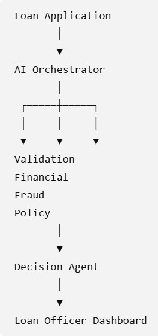

# Banking AI Harness

## AI Orchestration Framework for Explainable Loan Decision Support

The Banking AI Harness demonstrates how an AI orchestration framework can support loan officers by combining Large Language Models (LLMs), business rules, financial analysis, policy validation, and human oversight into a transparent decision-support workflow.

Unlike traditional machine learning projects that focus solely on prediction, this project emphasizes **harness engineering**—the orchestration layer that coordinates AI reasoning, tool execution, validation, and human review.

---

## Project Objective

Design and implement a production-inspired AI orchestration framework capable of assisting loan officers throughout the lending process.

The system demonstrates how AI can:

- Validate incoming loan applications
- Perform financial analysis
- Evaluate lending policy compliance
- Assess fraud indicators
- Generate explainable recommendations
- Escalate uncertain decisions to a human loan officer

The project uses a fully synthetic banking dataset and is intended for educational and research purposes.

---

## Architecture



---

## AI Orchestration Workflow

```text
Loan Application
        │
        ▼
Data Validation Agent
        │
        ▼
Financial Analysis Agent
        │
        ▼
Policy Engine
        │
        ▼
Fraud Assessment
        │
        ▼
Recommendation Agent
        │
        ▼
Human Loan Officer
```

---

## Planned Features

- AI Orchestration Framework
- Synthetic Banking Dataset
- Explainable Loan Recommendations
- Business Rule Validation
- Policy Engine
- Human-in-the-Loop Decision Support
- Interactive Streamlit Dashboard
- GitHub Portfolio Project

---

## Technology Stack

- Python
- Pandas
- NumPy
- Scikit-Learn
- Streamlit
- OpenAI API
- Git
- GitHub

---

## Repository Structure

```
banking-ai-harness/

architecture/
data/
docs/
images/
notebooks/
src/
streamlit/
tests/

README.md
LICENSE
requirements.txt
```

---

## Current Status

Project Status: 🚧 In Development

Current Milestone:

- Repository initialized
- Architecture defined
- Project structure completed

Next Milestones:

- Generate synthetic banking dataset
- Build orchestration workflow
- Develop AI agents
- Create Streamlit dashboard
- Publish GitHub demo

---

## Educational Purpose

This repository was developed as part of graduate coursework in Artificial Intelligence while exploring modern AI orchestration (harness engineering), explainable AI, and human-in-the-loop decision support systems.

Although inspired by real-world banking workflows, the project uses synthetic data exclusively and does not represent any financial institution.

---

## Future Enhancements

- Retrieval-Augmented Generation (RAG)
- Multi-Agent Collaboration
- Model Evaluation Dashboard
- Real-time Decision Analytics
- Cloud Deployment

---

## License

This project is licensed under the MIT License.