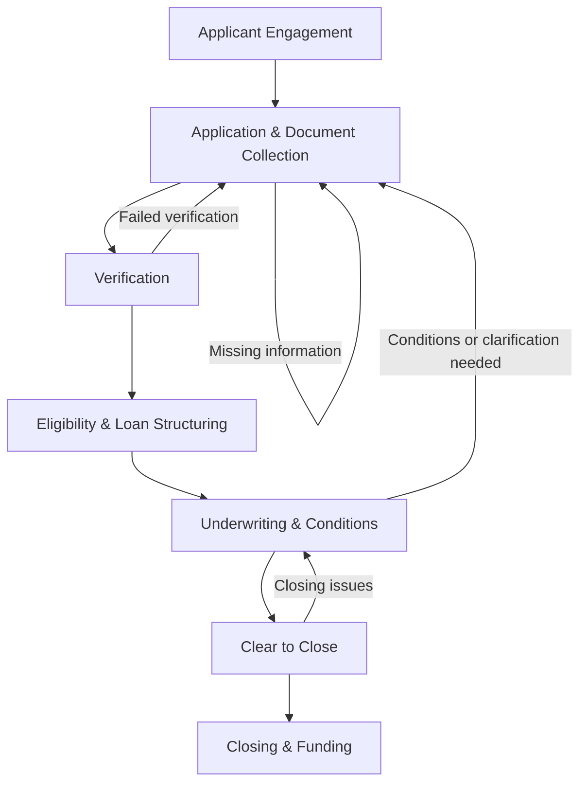

# Level 0 Value Stream for the Loan Officer AI Harness

## 1. Title

Level 0 Business Value Stream for the Loan Officer AI Harness
Version 1.0
Status: Approved Baseline

## 2. Document Purpose

This document refines the approved baseline into a structured Level 0 business requirements view for the Loan Officer AI Harness. Its purpose is to define the business process in a form that can later support decomposition into personas, epics, business capabilities, use cases, user stories, AI-agent definitions, functional requirements, nonfunctional requirements, and test cases.

The document shall remain a Level 0 business process artifact and shall not expand into implementation detail.

The following business requirements establish the baseline for this document:

- L0-REQ-001: The Level 0 value stream shall define the seven approved business phases in the specified order.
- L0-REQ-002: The process shall begin at Applicant Engagement and end at Closing & Funding.
- L0-REQ-003: The process shall preserve human authority for lending decisions, approvals, and overrides.
- L0-REQ-004: The process shall use AI only as explainable business assistance and shall not replace human accountability.
- L0-REQ-005: The process shall support traceability of material information, status, and workflow decisions.
- L0-REQ-006: The process shall support return paths to earlier phases when information is incomplete, conflicting, or unresolved.
- L0-REQ-007: The process shall support pause, hold, withdrawal, suspension, and denial paths without changing the defined scope boundaries.
- L0-REQ-008: Each business phase shall use a consistent structure for business requirements traceability.
- L0-REQ-009: The document shall remain suitable for later decomposition into Agile and systems engineering artifacts without increasing the level of detail beyond Level 0.

## 3. Scope

### In Scope

The value stream shall begin when a potential borrower engages with a loan officer and shall end when the loan is closed and funded.

The initial scope shall include the following seven phases, in order:

1. Applicant Engagement
2. Application & Document Collection
3. Verification
4. Eligibility & Loan Structuring
5. Underwriting & Conditions
6. Clear to Close
7. Closing & Funding

The scope shall include workflow visibility, information coordination, decision support, human review, and traceability across the defined phases.

### Out of Scope

The following activities are outside the initial scope of this Level 0 value stream:

- Marketing
- Lead generation
- Mortgage servicing
- Payment collection
- Delinquency
- Default
- Foreclosure
- Secondary-market sales
- Post-closing quality control

These topics are excluded because they fall outside the defined start and end boundaries of the business process.

## 4. Primary Business Objective

The primary business objective of the Loan Officer AI Harness shall be to assist mortgage professionals in guiding an applicant from initial engagement through closing and funding with greater speed, consistency, transparency, traceability, and human oversight.

The harness shall support, rather than replace, authorized human judgment. It shall improve workflow visibility, reduce avoidable rework, and provide explainable assistance while preserving accountability for regulated lending decisions.

## 5. Level 0 Value Stream Overview

The mortgage journey shall be treated as a collaborative business process that combines applicant interaction, document collection, verification, eligibility assessment, underwriting review, closing preparation, and funding. The process shall not be assumed to be strictly linear. Information gaps, conflicting facts, policy exceptions, and applicant decisions may require return to earlier phases.

At a high level, the value stream shall move from initial interest and information gathering toward a decision to proceed, a final readiness decision, and ultimately a completed closing and disbursement of funds. Throughout the value stream, the workflow shall provide visibility into status, missing information, next actions, and the basis for recommendations.

## 6. Level 0 Flowchart

The flowchart depicts the primary path while showing the most important return loops for information gaps, verification issues, underwriting conditions, and clear-to-close concerns.

## 7. Value Stream Summary Table

| Phase | Purpose | Primary Participants | Key Inputs | Key Outputs | Business Outcome |
|---|---|---|---|---|---|
| Applicant Engagement | Establish initial interest and determine whether to proceed. | Applicant, Loan Officer | Initial inquiry, borrower intent, basic loan needs | Engagement summary, initial request context | A clear entry into the process |
| Application & Document Collection | Gather the information and documents required for evaluation. | Applicant, Loan Officer, Loan Processor | Application details, documents, borrower responses | Application package, missing-item status | A usable loan file is established |
| Verification | Validate core facts and supporting evidence. | Applicant, Loan Officer, Loan Processor | Identity, income, asset, employment, and credit information | Verified facts, clarification requests, unresolved issues | Core facts are validated or escalated |
| Eligibility & Loan Structuring | Assess preliminary fit and propose a suitable structure. | Applicant, Loan Officer | Verified data, product considerations, affordability factors | Eligibility view, proposed structure, preliminary terms | A workable path is identified |
| Underwriting & Conditions | Perform formal review and issue conditions where required. | Loan Officer, Underwriter, Loan Processor | Full file, conditions, risk considerations | Underwriting decision, conditions list, follow-up actions | The file is ready for final review |
| Clear to Close | Confirm readiness for closing. | Loan Officer, Loan Processor, Underwriter | Condition responses, final documents, status updates | Clear-to-close decision, closing checklist | The file is ready for execution |
| Closing & Funding | Complete closing and disburse funds. | Applicant, Loan Officer, Loan Processor | Final documents, closing instructions, funding requirements | Closed loan file, funding confirmation | The transaction is completed |

## 8. Detailed Phase Descriptions

### 8.1 Applicant Engagement

#### Purpose

The Applicant Engagement phase shall establish the initial business relationship between the applicant and the lender team. Its purpose shall be to clarify the borrower’s needs, communicate the general mortgage journey, and determine whether the applicant is ready to proceed with formal processing.

#### Business Trigger

The phase shall begin when a prospective borrower initiates contact or is referred into the process and expresses interest in obtaining a mortgage solution.

#### Entry Criteria

- A prospective borrower has initiated contact with a loan officer or has been referred into the process.
- The borrower has expressed interest in pursuing a mortgage solution.

#### Primary Activities

- Gather initial borrower needs and loan objectives.
- Provide introductory guidance on available mortgage options and next steps.
- Confirm whether the applicant wishes to proceed with a formal application.

#### Primary Participants

- Applicant
- Loan Officer

#### Key Inputs

- Initial inquiry or contact
- Borrower goals and timing expectations
- Basic financial context shared at intake

#### Key Outputs

- Initial engagement record
- Preliminary loan request context
- Decision to proceed or pause

#### Business Rules

- The applicant shall be informed of the general process and next steps.
- The loan officer shall determine whether the engagement is sufficiently actionable to proceed.
- The intake context shall be retained for later processing.

#### Business Risks

- The applicant does not proceed.
- The initial information is insufficient to begin processing.
- The applicant’s needs are unclear or inconsistent.

#### Potential AI Assistance

- Summarization of intake conversations
- Identification of missing borrower information
- Status communication and next-step guidance

#### Human Decision Points

The loan officer shall decide whether the engagement is sufficiently actionable to proceed to formal application intake.

#### Success Criteria

- The applicant’s initial needs are understood.
- The next action is clear to both the applicant and the loan team.
- The file is either accepted for further processing or appropriately paused.

#### Exit Criteria

- The applicant has agreed to proceed or declined to continue.
- The initial context needed to begin the application has been captured.

#### Business Outcome

The phase shall create a clear entry into the formal workflow and establish a shared understanding of the borrower’s objectives.

#### Next Phase

Application & Document Collection

### 8.2 Application & Document Collection

#### Purpose

The Application & Document Collection phase shall convert initial interest into a formal application package. Its purpose shall be to collect the information and supporting documents necessary to evaluate the borrower in a complete and organized manner.

#### Business Trigger

The phase shall begin when the applicant chooses to proceed following engagement.

#### Entry Criteria

- The applicant has chosen to proceed.
- The initial engagement context is available.

#### Primary Activities

- Collect the completed application and required borrower disclosures.
- Request and receive supporting documents such as income, asset, and identity evidence.
- Organize the information into a usable loan file.

#### Primary Participants

- Applicant
- Loan Officer
- Loan Processor

#### Key Inputs

- Borrower application data
- Requested supporting documents
- Initial disclosures and responses to intake questions

#### Key Outputs

- Application package
- Document checklist and status
- Initial file readiness view

#### Business Rules

- The application shall be submitted in a structured and reviewable form.
- Missing documents shall be identified and tracked.
- The file shall be prepared in a manner that supports later verification and review.

#### Business Risks

- The application remains incomplete.
- Required documents are missing or delayed.
- Submitted documents are unreadable or inconsistent with the application.

#### Potential AI Assistance

- Document classification
- Missing-data detection
- Information extraction from submitted documents
- Workflow coordination for outstanding requests

#### Human Decision Points

The loan officer or processor shall determine whether the application is sufficiently complete to move forward or should be placed on hold pending missing information.

#### Success Criteria

- The core application is received.
- The principal documents needed for review are identified and available or clearly outstanding.
- The file is positioned for the next review stage.

#### Exit Criteria

- The core application has been submitted.
- Required initial documents have been received or clearly identified as missing.

#### Business Outcome

A complete and reviewable application file shall be established so the loan can move into verification and evaluation.

#### Next Phase

Verification

### 8.3 Verification

#### Purpose

The Verification phase shall validate the borrower and the information provided to support the underwriting process. Its purpose shall be to reduce avoidable errors and confirm that the facts relied upon are credible and consistent.

#### Business Trigger

The phase shall begin when a preliminary application package exists and the information needed for verification is available or requested.

#### Entry Criteria

- A preliminary application package exists.
- The key documents needed for verification are available or requested.

#### Primary Activities

- Validate identity and supporting identity documents.
- Review income, employment, asset, and credit-related information.
- Identify discrepancies, missing evidence, or conflicting data.

#### Primary Participants

- Applicant
- Loan Officer
- Loan Processor

#### Key Inputs

- Application information
- Documented evidence
- Credit and income-related records
- External verification responses, where applicable

#### Key Outputs

- Verified facts and status notes
- Clarification requests or additional document requests
- Verification exceptions or unresolved issues

#### Business Rules

- Required verification information shall be reviewed before the file may proceed to later evaluation stages.
- Conflicting or unsupported information shall be escalated for clarification.
- Verification status shall remain visible to the processing team.

#### Business Risks

- Identity cannot be confirmed.
- Income or employment cannot be verified.
- Conflicting information is found.

#### Potential AI Assistance

- Consistency checking across multiple data sources
- Exception summarization
- Identification of conflicting information
- Explanation generation for verification findings

#### Human Decision Points

The loan officer or processor shall decide whether the verification results are sufficient to continue, require more evidence, or trigger a hold or denial decision.

#### Success Criteria

- The key facts required for assessment are validated or clearly unresolved.
- Material discrepancies are recognized and communicated.
- The file is ready for the next evaluation stage or appropriately paused.

#### Exit Criteria

- Core verification items are completed or formally escalated for follow-up.
- Material discrepancies have been addressed or documented.

#### Business Outcome

The loan file shall contain a reliable baseline of accepted information, or the file shall clearly identify what remains unresolved.

#### Next Phase

Eligibility & Loan Structuring

### 8.4 Eligibility & Loan Structuring

#### Purpose

The Eligibility & Loan Structuring phase shall assess whether the borrower appears reasonably suited to a mortgage solution and shall explore a suitable structure for the loan. Its purpose shall be to identify a viable path forward before full underwriting review is completed.

#### Business Trigger

The phase shall begin when verification information is sufficiently available to support an initial readiness assessment.

#### Entry Criteria

- Verification information is sufficiently available to support an initial readiness assessment.
- The borrower’s needs and financial profile are understood.

#### Primary Activities

- Evaluate preliminary eligibility against the requested loan parameters.
- Compare alternative structures or product options where appropriate.
- Estimate affordability and align the request with likely lender criteria.

#### Primary Participants

- Applicant
- Loan Officer

#### Key Inputs

- Verified borrower information
- Loan product considerations
- Preliminary affordability and qualification indicators

#### Key Outputs

- Preliminary eligibility assessment
- Proposed loan structure or alternatives
- Readiness to proceed to formal underwriting

#### Business Rules

- Preliminary eligibility shall be documented before formal underwriting review proceeds.
- Alternative structures shall be considered when the original request is not viable.
- The proposed path shall be communicated clearly to the applicant and processing team.

#### Business Risks

- The borrower does not meet preliminary eligibility expectations.
- The proposed structure is not suitable.
- The borrower requests a different financial arrangement.

#### Potential AI Assistance

- Recommendation support
- Scenario comparison summaries
- Affordability and qualification explanation support
- Status communication to the borrower and team

#### Human Decision Points

The loan officer shall determine whether the proposed structure is appropriate and whether the file should continue to underwriting.

#### Success Criteria

- A preliminary fit assessment is documented.
- A viable structure or alternative path is identified.
- The file is positioned for underwriting review or appropriately paused.

#### Exit Criteria

- A preliminary product or structure recommendation has been documented.
- The file is ready for underwriting or is paused due to lack of fit or missing information.

#### Business Outcome

A viable path shall be established for the loan file to proceed into formal underwriting with a clearer sense of fit and structure.

#### Next Phase

Underwriting & Conditions

### 8.5 Underwriting & Conditions

#### Purpose

The Underwriting & Conditions phase shall apply formal review to assess risk and determine whether the loan can proceed subject to conditions. Its purpose shall be to reach a defensible underwriting decision that is transparent and reviewable.

#### Business Trigger

The phase shall begin when the file has progressed through verification and eligibility assessment and sufficient information is available for formal review.

#### Entry Criteria

- The file has progressed through verification and eligibility assessment.
- Sufficient information is available for formal review.

#### Primary Activities

- Review the application, documents, and supporting findings in a formal underwriting context.
- Determine whether the file is acceptable, acceptable with conditions, or not acceptable.
- Issue conditions or follow-up requests when required.

#### Primary Participants

- Loan Officer
- Underwriter
- Loan Processor

#### Key Inputs

- Complete application file
- Verification findings
- Eligibility and structure assessment
- Risk and policy considerations

#### Key Outputs

- Underwriting decision
- Conditions list
- Follow-up actions and deadlines

#### Business Rules

- Underwriting shall document a clear decision status for the file.
- Conditions shall be tracked and resolved before the file can proceed to closing readiness.
- Human review shall remain necessary for final underwriting decisions.

#### Business Risks

- Conditions are not satisfied.
- Additional documentation is requested late in the process.
- The file is suspended or denied.

#### Potential AI Assistance

- Consistency checking across the file
- Summarization of key underwriting issues
- Explanation generation for decision rationale
- Workflow coordination for condition tracking

#### Human Decision Points

The underwriter and loan officer shall make the final human decision on acceptability, conditions, or denial, with accountability for the outcome.

#### Success Criteria

- A clear underwriting decision is issued.
- Conditions are identified and understood.
- The file is positioned for either further processing or a decisive stop.

#### Exit Criteria

- The underwriting decision is documented.
- Any required conditions are identified and assigned for follow-up.

#### Business Outcome

The file shall reach a clear underwriting position that can be acted on, challenged, or returned for additional evidence.

#### Next Phase

Clear to Close

### 8.6 Clear to Close

#### Purpose

The Clear to Close phase shall confirm that all required conditions, documentation, and readiness checks have been completed. Its purpose shall be to prevent avoidable closing delays and ensure the loan is truly prepared for execution.

#### Business Trigger

The phase shall begin when underwriting has produced a favorable decision or an acceptable conditions path and the required condition responses are available for review.

#### Entry Criteria

- Underwriting has produced a favorable decision or acceptable conditions path.
- Required condition responses have been received and reviewed.

#### Primary Activities

- Review remaining readiness items.
- Confirm that all outstanding conditions are resolved.
- Prepare the file for final closing execution.

#### Primary Participants

- Loan Officer
- Loan Processor
- Underwriter

#### Key Inputs

- Underwriting decision
- Condition responses
- Updated documents and status notes

#### Key Outputs

- Clear-to-close decision
- Final readiness checklist
- Closing instructions or pending items

#### Business Rules

- Critical readiness items shall be reviewed before closing can begin.
- Remaining issues shall be resolved or explicitly carried forward.
- Clear-to-close status shall be based on documented readiness.

#### Business Risks

- Closing is delayed due to incomplete conditions.
- Final documents are missing.
- Last-minute information conflicts emerge.

#### Potential AI Assistance

- Checklist validation
- Summary of outstanding readiness items
- Coordination of status updates
- Explanation of final readiness status

#### Human Decision Points

The loan officer and processing team shall confirm that the file is sufficiently ready for closing and that no unresolved material issues remain.

#### Success Criteria

- The file is confirmed ready for closing.
- No material readiness issues remain unresolved.
- Closing instructions are clear and actionable.

#### Exit Criteria

- All critical readiness items have been confirmed.
- The file has been approved for closing.

#### Business Outcome

The file shall be confirmed as ready for closing and the remaining steps shall be able to proceed with confidence.

#### Next Phase

Closing & Funding

### 8.7 Closing & Funding

#### Purpose

The Closing & Funding phase shall complete the transaction and ensure the borrower receives funds in accordance with agreed terms. Its purpose shall be to finalize the business outcome of the process and confirm that the loan is fully executed.

#### Business Trigger

The phase shall begin when the file has received clear-to-close status and final closing documents are available.

#### Entry Criteria

- The file has received clear-to-close status.
- Final closing documents are prepared and available.

#### Primary Activities

- Execute final loan documentation.
- Complete the closing transaction.
- Finalize funding and confirm the loan is funded.

#### Primary Participants

- Applicant
- Loan Officer
- Loan Processor

#### Key Inputs

- Final documents
- Closing instructions
- Final review and approval status

#### Key Outputs

- Closed loan record
- Funding confirmation
- Completed transaction status

#### Business Rules

- Closing execution shall be completed only when the file is ready.
- Funding status shall be recorded as part of the transaction record.
- The business outcome shall be documented for future traceability.

#### Business Risks

- Funding is delayed.
- Funding fails after closing execution.
- Final documents are not available at the time of closing.

#### Potential AI Assistance

- Document summarization
- Status communication
- Exception tracking for funding delays
- Traceability support for completed records

#### Human Decision Points

The loan officer and processing team shall confirm that the closing was completed properly and that the resulting funding status is accepted.

#### Success Criteria

- The loan is closed and funded in accordance with the approved process.
- The final transaction status is recorded.
- The file is complete and traceable.

#### Exit Criteria

- The closing has been completed.
- Funds have been disbursed or the funding status is clearly recorded.

#### Business Outcome

The loan shall reach its intended end state: closed and funded, with a complete and traceable record of the business process.

#### Next Phase

None. Process end state.

## 9. Cross-Phase Business Rules

The value stream shall reflect the following business rules at a Level 0 level:

- The process shall not be assumed to be strictly linear. A loan may need to return to an earlier phase when information is incomplete, conflicting, expired, or rejected.
- A loan may be withdrawn, suspended, placed on hold, or denied at any point before closing.
- Human users shall retain responsibility for regulated lending decisions and final approvals.
- AI outputs shall be explainable, reviewable, and understandable to human users.
- Material information shall retain source and status traceability throughout the process.
- Applicant data shall be handled securely and with appropriate confidentiality controls.
- Duplicate data entry and repeated document requests shall be minimized where possible.
- Users shall have visibility into current status, missing information, and next actions.

## 10. Exception Paths

The following exception paths are relevant at this Level 0 view and shall be understood as business interruptions or decision points rather than fully detailed workflows:

- Applicant chooses not to proceed.
- The application is incomplete.
- Required documents are missing or delayed.
- Information cannot be verified.
- Conflicting information is identified.
- The applicant is not eligible for the requested loan.
- An alternative loan structure is proposed.
- Underwriting conditions are not satisfied.
- The loan is suspended or denied.
- The applicant withdraws.
- Closing is delayed.
- Funding is delayed or fails.

These paths shall be elaborated later in more detailed use cases and requirements.

## 11. Human Decision and Approval Points

The harness shall support human authority throughout the process. The principal decision and approval points shall include:

- Whether to begin or continue applicant engagement.
- Whether an application is sufficiently complete to move forward.
- Whether verification findings are acceptable or require more evidence.
- Whether a proposed loan structure is appropriate.
- Whether underwriting can approve the file, approve it with conditions, or deny it.
- Whether the file is clear to close.
- Whether closing and funding can be completed successfully.

These decisions shall remain under human accountability, while the harness provides context, status, and explainable support.

## 12. High-Level AI Assistance Opportunities

At this Level 0 level, AI assistance shall be treated as business support rather than automated authority. High-level opportunities include:

- Summarization of applicant interactions and file history.
- Information extraction from submitted documents.
- Document classification and tracking of missing items.
- Missing-data detection and exception highlighting.
- Consistency checking across application, verification, and underwriting data.
- Recommendation support for loan structure or next actions.
- Workflow coordination for status updates and follow-up tasks.
- Explanation generation that shows why a recommendation or issue was surfaced.
- Status communication to applicants and internal users.

## 13. Traceability to Future Artifacts

This value stream shall provide the business foundation for later artifacts, including:

- Personas
- Epics
- Business capabilities
- AI agents
- Use cases
- User stories
- Functional requirements
- Test cases

Each phase shall eventually trace to these future artifacts so that business intent can be carried forward into Agile delivery and systems engineering activities. The document shall not define those artifacts in detail.

## 14. Assumptions

The following assumptions are made for planning purposes and shall be validated by subject-matter experts during later refinement:

- The harness shall be used alongside existing mortgage operations rather than replacing human authority.
- Mortgage practices, product rules, and approval thresholds may vary by lender, loan type, jurisdiction, and policy.
- External systems may participate in the process, but they shall not be treated as separate human participants in this document.
- The harness shall be designed to support explainability, reviewability, and workflow transparency.

These assumptions shall not be presented as confirmed requirements.

## 15. Open Questions

The following questions shall be addressed during later requirements and design work:

- Which specific mortgage products and workflows should be prioritized in the initial scope?
- Which document types and verification sources are mandatory for the first release?
- Which statuses and milestones should be visible to applicants and internal users?
- What level of exception handling must be supported before the harness is considered operationally useful?
- How will the organization define and maintain the evidence trail for explainability and auditability?

## 16. Conclusion

The Level 0 value stream for the Loan Officer AI Harness shall define a human-centered mortgage workflow that begins with applicant engagement and ends with closing and funding. It shall provide a clear business foundation for understanding how a loan moves through the process, where human judgment is essential, and where AI can provide explainable assistance.

This document is intentionally business-oriented and high level. It is intended to support later analysis and solution design without prematurely narrowing the problem to a specific implementation approach or assuming automated authority over regulated lending decisions.
